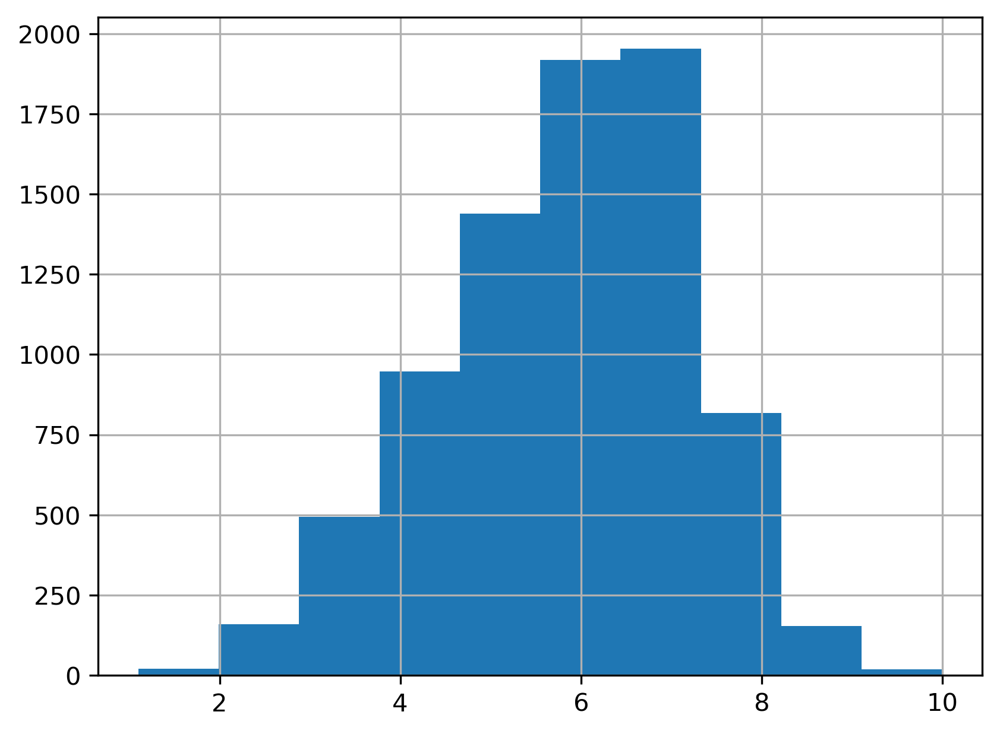
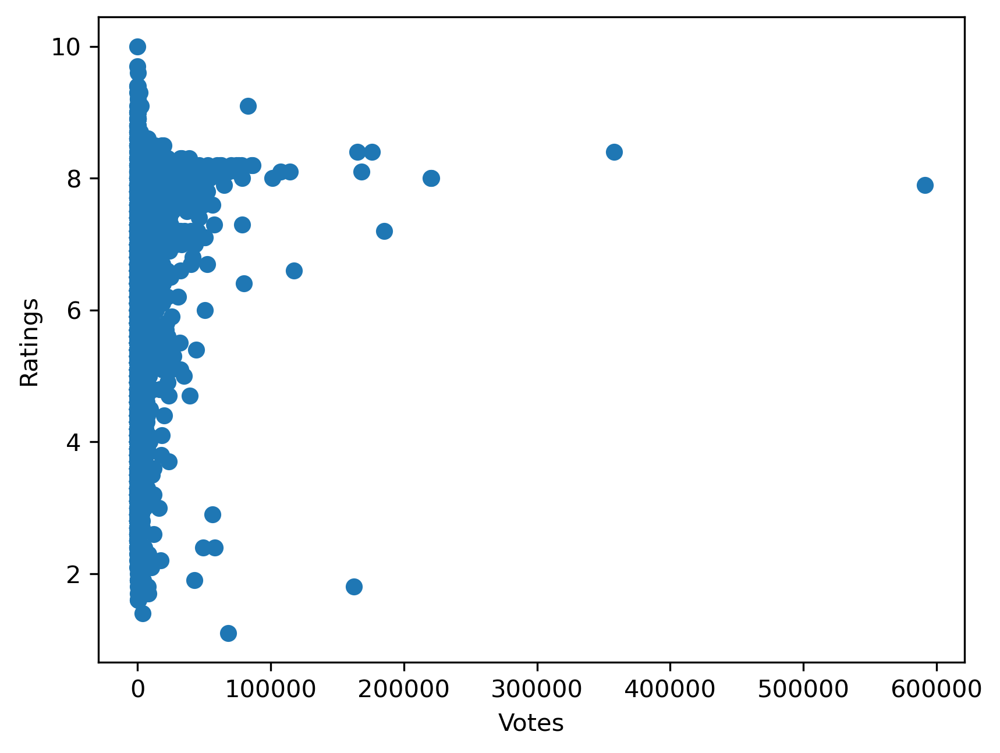
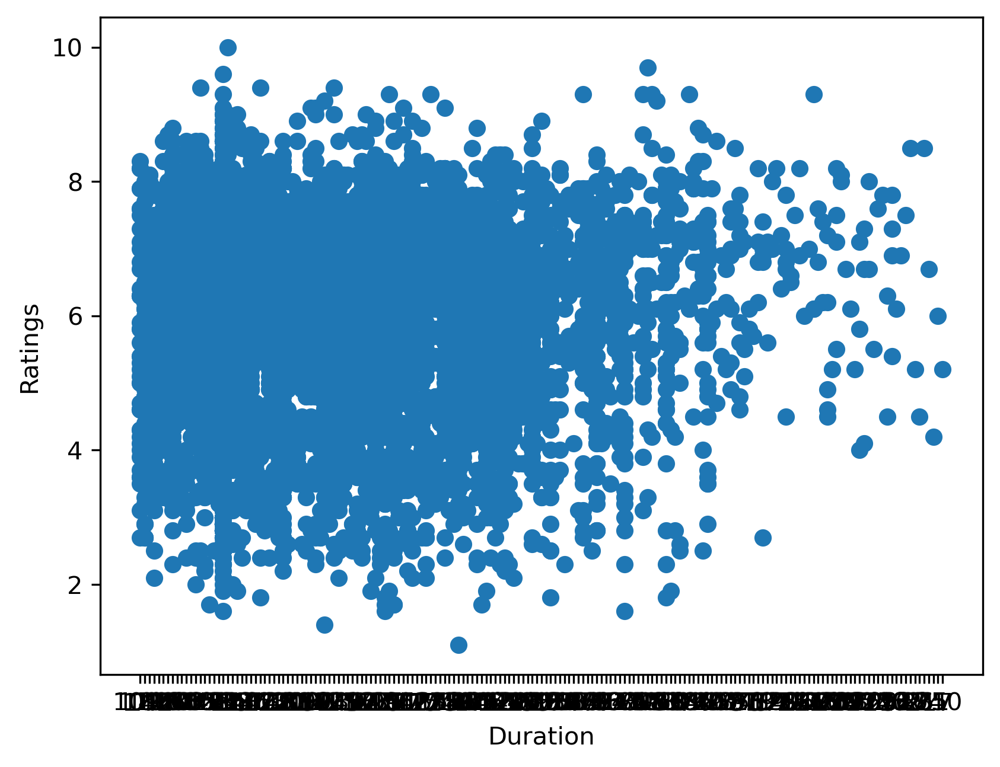

# 🎬 IMDb Movie Rating Prediction using Machine Learning

## 📌 Project Overview

This project aims to predict IMDb movie ratings using Machine Learning techniques. The dataset contains information about Indian movies, including genres, directors, actors, duration, and vote counts.

The project covers the complete Data Science workflow:

✅ Data Cleaning
✅ Exploratory Data Analysis (EDA)
✅ Feature Engineering
✅ Machine Learning Model Building
✅ Model Evaluation
✅ Feature Importance Analysis

---
## 📈 Results Summary

| Metric | Score |
|----------|----------|
| MAE | 0.983 |
| RMSE | 1.254 |
| R² Score | 0.151 |

### 🔍 Key Findings

- 👍 Votes were the most influential feature.
- 🎭 Drama was the most common genre.
- 🎬 Gulzar was the highest-rated director (minimum 10 films).
- ⭐ Dev Anand had the highest average rating among actors with 50+ movies.
- 📊 Genre and actor information significantly impacted predictions.
## 🎯 Objective

To build a machine learning model capable of predicting IMDb movie ratings based on:

* 🎭 Genre
* 🎬 Director
* ⭐ Lead Actors
* ⏱️ Duration
* 👍 Number of Votes

---

## 📊 Dataset Information

**Dataset Size**

| Metric                | Value  |
| --------------------- | ------ |
| Total Records         | 15,509 |
| Final Cleaned Records | 7,558  |
| Features              | 10     |

### Dataset Features

| Feature  | Description      |
| -------- | ---------------- |
| Name     | Movie Name       |
| Year     | Release Year     |
| Duration | Movie Duration   |
| Genre    | Movie Genre      |
| Votes    | IMDb Votes       |
| Director | Director Name    |
| Actor 1  | Lead Actor       |
| Actor 2  | Supporting Actor |
| Actor 3  | Supporting Actor |
| Rating   | IMDb Rating ⭐    |

---

## 🧹 Data Preprocessing

The following preprocessing steps were performed:

* Removed missing values
* Removed duplicate records
* Converted Duration into numeric format
* Converted Votes into numeric format
* Label encoded categorical variables
* Prepared training and testing datasets

### Missing Values Removed

| Column   | Missing Values |
| -------- | -------------- |
| Year     | 528            |
| Duration | 8269           |
| Genre    | 1877           |
| Rating   | 7590           |
| Votes    | 7589           |
| Director | 525            |
| Actor 1  | 1617           |
| Actor 2  | 2384           |
| Actor 3  | 3144           |

After cleaning:

✅ No missing values remained.

---

# 📈 Exploratory Data Analysis

## 🎭 Most Common Genres

| Genre                | Count |
| -------------------- | ----- |
| Drama                | 1137  |
| Drama, Romance       | 443   |
| Action, Crime, Drama | 417   |
| Action               | 391   |
| Drama, Family        | 291   |

### Insight

Drama is the dominant genre in the dataset, indicating that Indian cinema is heavily represented by drama-oriented films.

---

## 🏆 Highest Rated Genres

| Genre                        | Average Rating |
| ---------------------------- | -------------- |
| History, Romance             | 9.40           |
| Documentary, Family, History | 9.30           |
| Documentary, Music           | 8.90           |
| Documentary, Thriller        | 8.70           |
| Documentary, Sport           | 8.60           |

### Insight

Documentary and historical genres tend to receive the highest audience ratings.

---

## 🎬 Top Directors (Minimum 10 Movies)

| Director        | Avg Rating |
| --------------- | ---------- |
| Gulzar          | 7.55       |
| Anurag Kashyap  | 7.40       |
| Bimal Roy       | 7.29       |
| Shyam Benegal   | 7.25       |
| Govind Nihalani | 7.15       |

### Insight

Directors such as Gulzar and Anurag Kashyap consistently produce highly-rated films.

---

## ⭐ Actors with Most Films

| Actor              | Movie Count |
| ------------------ | ----------- |
| Mithun Chakraborty | 231         |
| Dharmendra         | 217         |
| Jeetendra          | 179         |
| Ashok Kumar        | 173         |
| Amitabh Bachchan   | 162         |

### Insight

Mithun Chakraborty and Dharmendra are the most frequently appearing actors in the dataset.

---

## 🌟 Top Leading Actors (Minimum 50 Movies)

| Actor         | Avg Rating |
| ------------- | ---------- |
| Dev Anand     | 6.79       |
| Shammi Kapoor | 6.71       |
| Ashok Kumar   | 6.44       |
| Sanjeev Kumar | 6.43       |
| Rajesh Khanna | 6.38       |

### Insight

Dev Anand has the highest average rating among actors with substantial film counts.

---

# 📊 Visualizations

## ⭐ Rating Distribution

### Observation

Most movie ratings fall between **5 and 7.5**, indicating a relatively balanced distribution of movie quality.

---

## 👍 Votes vs Ratings

### Observation

Movies with higher vote counts tend to cluster around average-to-high ratings, suggesting popularity influences rating stability.

---

## ⏱️ Duration vs Ratings

### Observation

No strong relationship exists between movie duration and ratings.

---

# 🤖 Machine Learning Model

## Model Used

🌲 **Random Forest Regressor**

### Features Used

* Genre
* Director
* Actor 1
* Actor 2
* Actor 3
* Votes
* Duration

### Target Variable

⭐ Rating

### Train-Test Split

| Dataset      | Size |
| ------------ | ---- |
| Training Set | 6046 |
| Testing Set  | 1512 |

---

# 📉 Model Performance

| Metric   | Score |
| -------- | ----- |
| MAE      | 0.983 |
| RMSE     | 1.254 |
| R² Score | 0.151 |

### Interpretation

* The model predicts movie ratings with an average error of approximately **1 rating point**.
* The R² score indicates that the current features explain around **15% of the variance** in movie ratings.
* Additional metadata and advanced feature engineering could improve performance.

---

# 🔥 Feature Importance

| Rank | Feature  | Importance |
| ---- | -------- | ---------- |
| 1    | Votes    | 19.34%     |
| 2    | Genre    | 16.65%     |
| 3    | Actor 1  | 13.49%     |
| 4    | Director | 12.89%     |
| 5    | Actor 3  | 12.88%     |
| 6    | Actor 2  | 12.63%     |
| 7    | Duration | 12.12%     |

### Key Finding

👍 **Votes** emerged as the most influential feature for predicting movie ratings, followed by **Genre** and **Lead Actors**.

---

# 🛠️ Technologies Used

* 🐍 Python
* 🐼 Pandas
* 🔢 NumPy
* 📊 Matplotlib
* 🤖 Scikit-Learn
* 📓 Jupyter Notebook

---

# 🚀 Future Improvements

* Implement One-Hot Encoding
* Hyperparameter Tuning
* Try XGBoost Regressor
* Feature Engineering using Actor/Director historical ratings
* Include Budget, Revenue, and Review Features

---

# 👨‍💻 Author

**Waheed**

Machine Learning Internship Project

⭐ If you found this project useful, consider giving it a star!
